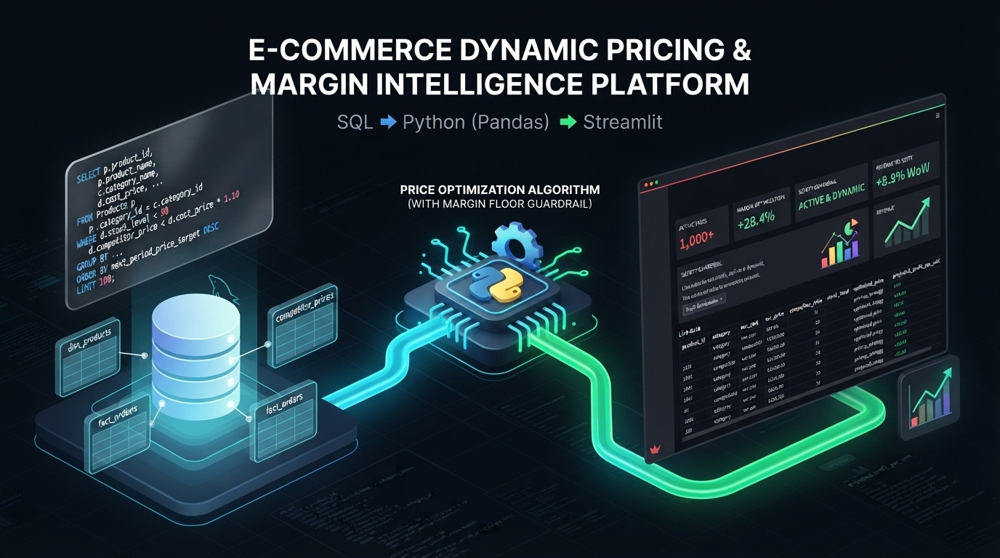

# 🛒 E-Commerce Dynamic Pricing & Margin Intelligence Platform
<p align="center">
  
</p>

---

## 📌 Project Overview
The E-Commerce Dynamic Pricing and Margin Intelligence Platform is an advanced data-driven system built to optimize online product pricing. It bridges the gap between raw database engineering, automated pricing algorithms, and real-time interactive web dashboards. By continuously monitoring inventory health, competitor pricing data, and profit margins, the platform dynamically recommends or enforces optimal prices to maximize revenue while safeguarding baseline profitability.

---

## ❓ Why We Did This Project (The Problem)
In modern e-commerce, manual pricing is slow, inefficient, and prone to severe financial risks:
* **Margin Erosion:** Merchants often drop prices to beat competitors without checking their cost basis, resulting in items being sold at a loss.
* **Dead-Stock Capital Lockup:** Excess inventory ties up valuable warehouse space and cash flow because items fail to move when priced too high.
* **Stockouts on High-Demand Items:** Fast-selling products with low stock levels run out quickly if prices are not adjusted upward to manage demand scarcity.
* **Data Disconnection:** Raw transactional data and competitor scraping data usually sit isolated in relational databases, making it difficult for stakeholders to visualize and act on pricing strategies instantly.

---

## 💡 The Solution Involved
This project solves these challenges by implementing a multi-layered automated pipeline:
1. **Relational Database Architecture:** Modeled product catalogs, competitor pricing feeds, and order transactions in MySQL Workbench to maintain clean, structured historical data.
2. **Automated Pricing Engine:** Developed custom algorithms in Python that evaluate inventory turnover, stock scarcity, and competitor rates in real-time.
3. **Safety Guardrails (Cost Floors):** Built hard-coded margin floor protection rules so that automated pricing changes can never drop below a mandatory minimum profit threshold.
4. **Interactive Web Dashboard:** Deployed a live Streamlit web application providing dynamic controls, category filters, and immediate metric tracking across thousands of SKUs.

---

## 🛠️ Technology Used
* **Python:** Core programming language used for data manipulation and engine simulation.
* **Pandas & NumPy:** High-performance libraries for structured tabular data processing and mathematical vector operations.
* **MySQL Workbench:** Relational database management system for schema design, multi-table joins, and SQL analytics.
* **Streamlit:** Framework for building and deploying interactive web applications and executive dashboards.
* **Visual Studio Code & Jupyter Notebooks:** Integrated development environments used for code execution, scripting, and iterative debugging.
* **Git & GitHub:** Version control systems used for source code management and project hosting.

---

## 📊 Project Visuals & Implementation Gallery

### Phase 1: Relational Database Architecture & SQL Analytics (MySQL Workbench)

* **Product Catalog Schema (`dim_products`):**
  .png)

* **Competitor Intelligence Feed (`competitor_prices`):**
  .png)

* **Transactional Order History (`fact_orders`):**
  .png)

* **Order Revenue Calculation via Joins:**
  .png)

* **Market Positioning Classification:**
  .png)

* **Gross Profit Margin Analysis:**
  .png)

* **Category-Level Inventory Exposure Summary:**
  .png)

* **Dead-Stock vs High Velocity Classification:**
  .jpg)

* **Advanced Common Table Expressions (CTEs) for Pricing Targets:**
  .jpg)

---

### Phase 2: Python Core Engine & Simulation (VS Code / Jupyter Notebooks)

* **Initial Dataframe Setup:**
  .png)

* **Core Pricing Engine Logic Implementation:**
  .png)

* **Advanced Profit Margin Floor Guardrails:**
  .png)

* **Enterprise-Scale Data Generation (1,000+ SKUs):**
  .png)

* **CSV Export Confirmation:**
  .png)

---

### Phase 3: Interactive Streamlit Web Console

* **Initial Local Web Dashboard Preview:**
  .png)

* **Fully Scaled Enterprise Dynamic Pricing Dashboard:**
  .jpg)

---

## 🚀 How to Use It

1. **Clone the Repository:**
   ```bash
   git clone [https://github.com/steph45acke-hue/E-COMMERCE-DYNAMIC-PRICING-PLATFORM.git](https://github.com/steph45acke-hue/E-COMMERCE-DYNAMIC-PRICING-PLATFORM.git)
   cd E-COMMERCE-DYNAMIC-PRICING-PLATFORM

